<h1 align="center">Google CoffeeApp Gradle Project </h1>
<h2 align="center">Java, Dagger2 and Intellij IDEA </h2>

<p align="center">
    
</p>

## Setting Up
1. Creating a new project.

<p align="center">
    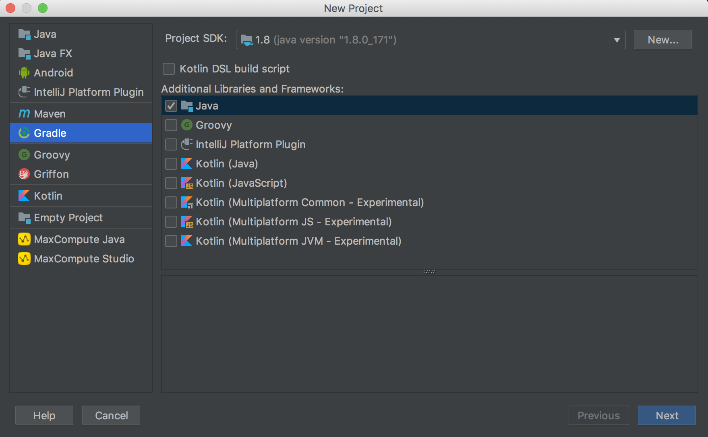
</p>

2. Set a GroupId and ArtifactId

<p align="center">
    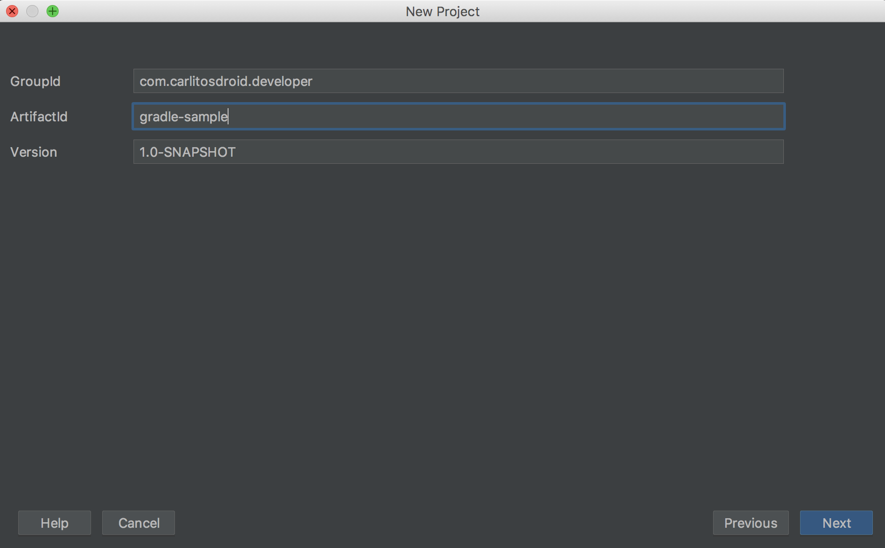
</p>


3. Uncheck **Create separate module per source set** because for this simple project we don't need to worry about
multiple source sets.

<p align="center">
    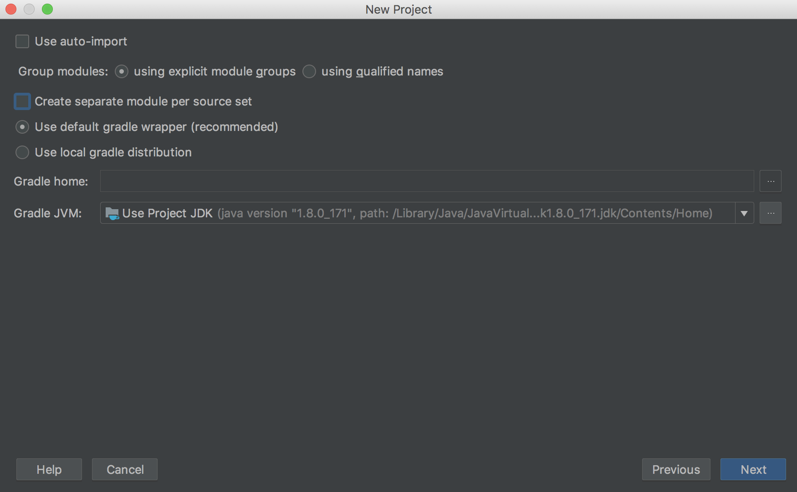
</p>

4. Set a **Project Name**

<p align="center">
    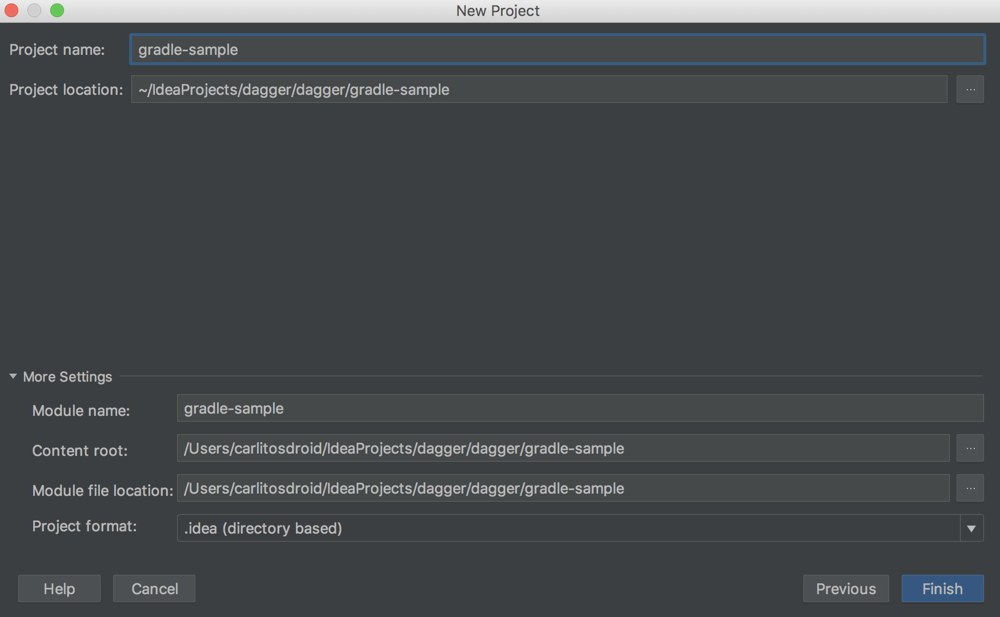
</p>

5. At first we wont have an **src** folder, instead, we have to go:
Preferences -> **Build, Execution, Deployment** > **Build Tools** > **Gradle**
and check **Create directories for empty content roots automatically**

<p align="center">
    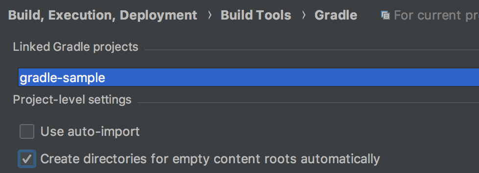
</p>

6. For using Dagger 2 we need to add an *annotationProcessor* in our build.gradle file.
So, go to:
Preferences -> **Build, Execution, Deployment** > **Compiler** > **AnnotationProcessors**
and check **Enabling annotation processing**

<p align="center">
    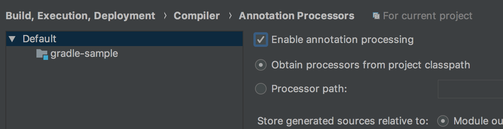
</p>

7. Import changes in gradle.file

<p align="center">
    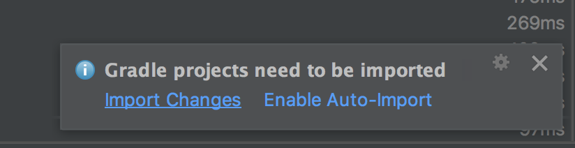
</p>

8. We'll have something like this:

<p align="center">
    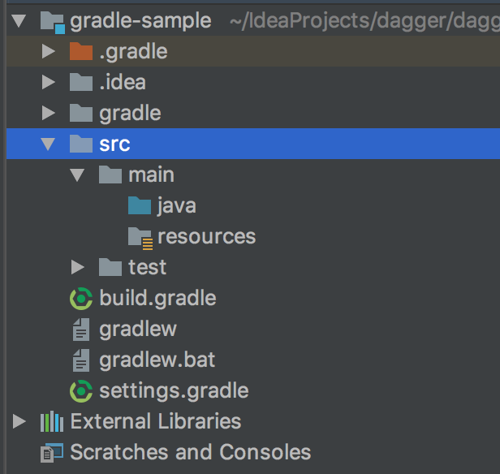
</p>

## Getting Started

### Adding Dagger 2

```groovy
dependencies {
    testCompile group: 'junit', name: 'junit', version: '4.12'
    implementation 'com.google.dagger:dagger:2.15'
    annotationProcessor 'com.google.dagger:dagger-compiler:2.15'
}
```

For using **annotationProcessor** inside dependencies block we need to add the
[net.ltgt.apt](https://plugins.gradle.org/plugin/net.ltgt.apt). You'll see that **there are
two forms of adding it**. Use only one.
For more information visit: [Gradle Plugin Github Repository](https://github.com/tbroyer/gradle-apt-plugin).

Don't forget that if you use the ´plugins block´ this has to be at the top of the build.gradle file.

Example:
This is correct:
```groovy
plugins {
    // ...
}

dependencies {
    // ...
}
```
This also is correct:
```groovy
buildScript {
    // ...
}

plugins {
    // ...
}

repositories {
    // ...
}
```
This is incorrect:
```groovy
repositories {
     // ...
}

plugins {
    // ...
}
```

## Using Dagger Generated Classes

* If we want to use the **DaggerCoffeeApp_CoffeeShop** class generated by Dagger
we must to `build` the project as follows:

<p align="center">
    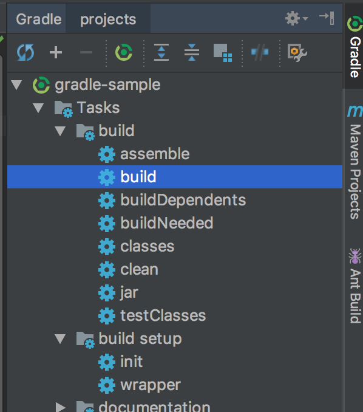
</p>

* A build folder will be generated:

<p align="center">
    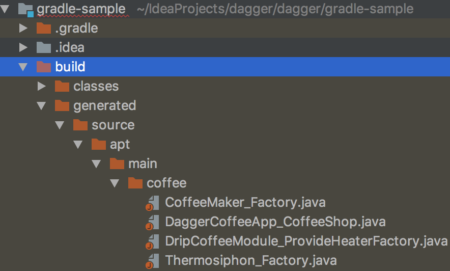
</p>

* If we want to use the generated classes inside the coffee folder, we musto to
change the Source Type. Go to **Project Structure** > **Modules**
<p align="center">
    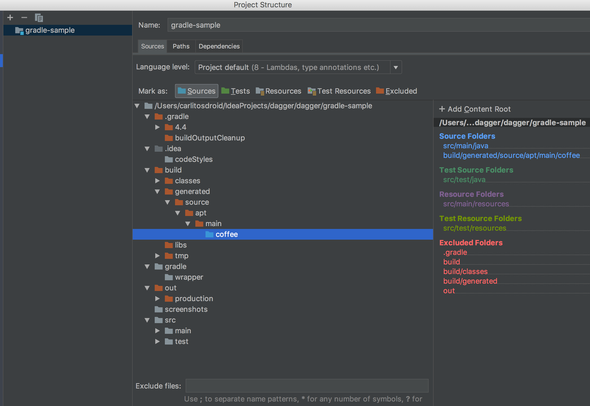
</p>

* We'll be able to use the generated dagger classes
<p align="center">
    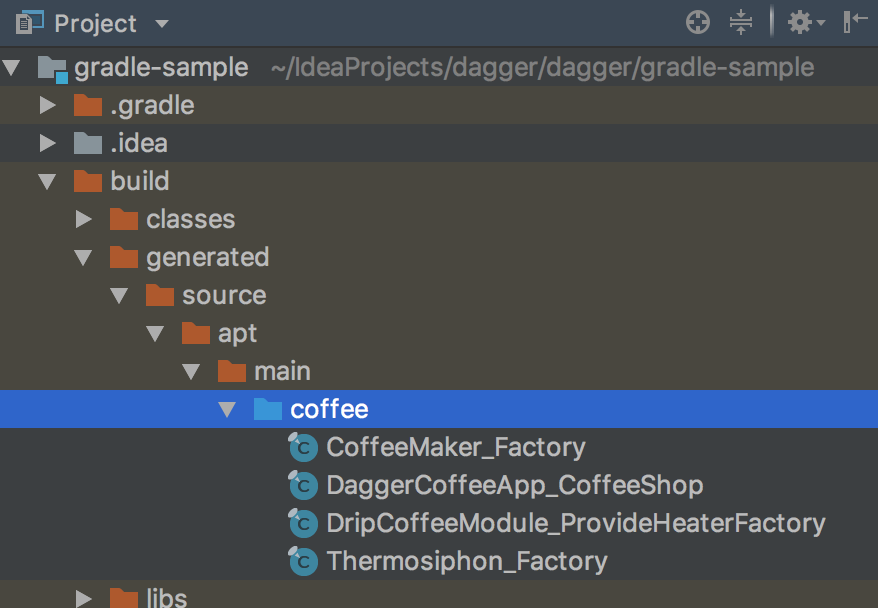
</p>

* We fully will see the `DaggerCoffeeApp_CoffeeShop` generated

<p align="center">
    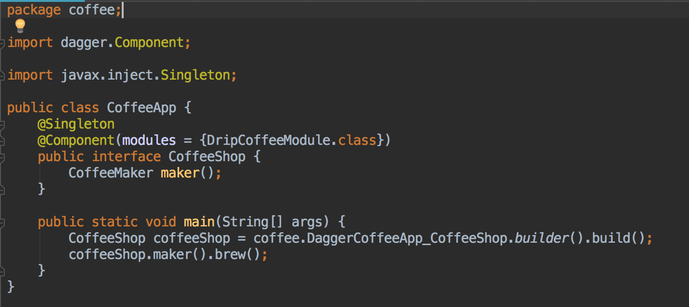
</p>